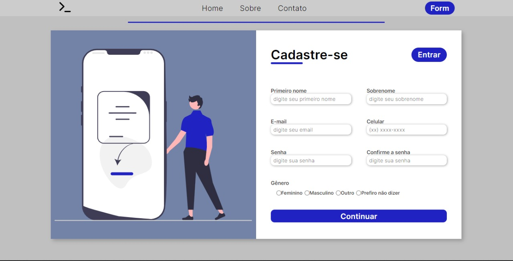
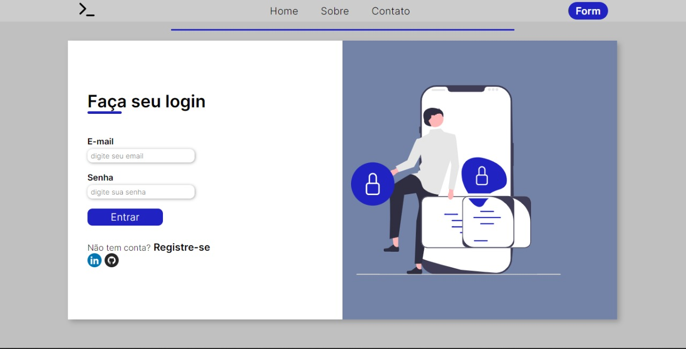
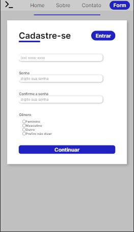
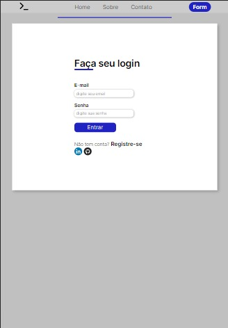

<h1 align="center"> Formulário</h1>

 Projeto desenvolvido com o objetivo de aprimorar os conceitos e aprendizados em HTML5 e CSS3. 

<video src="./img_rm/form-video.mp4"></video>

## 📕 Índice

- [📋 Sobre](#Sobre)
- [🕹 Tecnologias](#Tecnologias)
- [👩🏻💻 Visualizando o projeto](#Visualizando)
- [📲 Contatos](#Contatos)

<!-- About -->

# Sobre

 📋 Este projeto é a criação de um formulário resposivo, e ainda em processo de produção. Pretendo aprimorá-lo e deixá-lo mais funcional. 

<!-- TECHNOLOGIES -->

# Tecnologias

- 🧩 **Tecnologias**
  - [HTML5](https://developer.mozilla.org/pt-BR/docs/Web/HTML)
  - [CSS3](https://developer.mozilla.org/pt-BR/docs/Web/CSS)
  - [JS](https://developer.mozilla.org/pt-BR/docs/Web/JavaScript)

<!-- TECHNOLOGIES -->

# Vizualizando

1 - Para verificar a funcionalidade da página é recomendado instalar a extensão Live Server no VsCode.   2 - Clicar no arquivo HTML com o botão direito e selecionar a opção "Open with Live Server"

 

 
